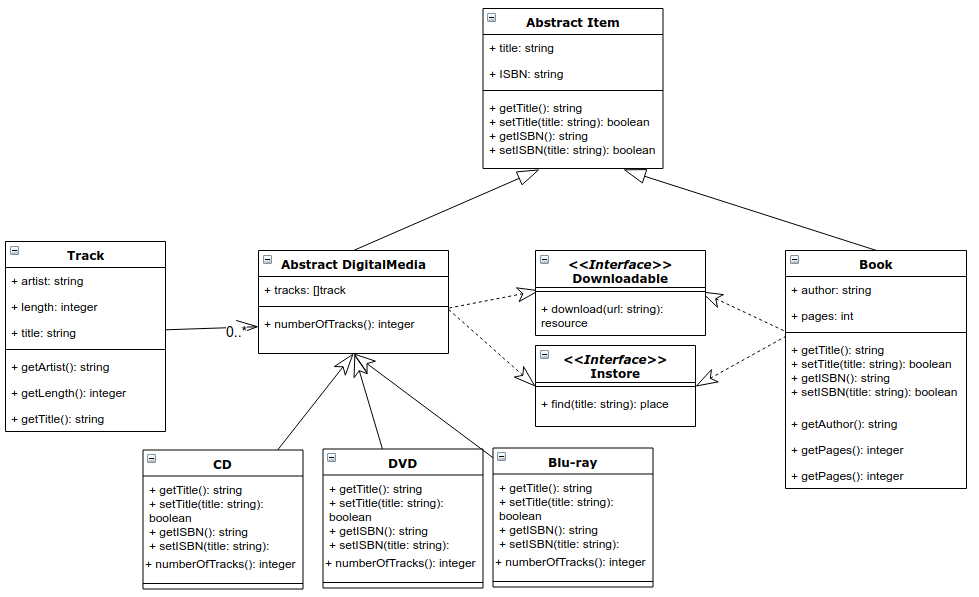

# Excersice 1

A class or interface has a name, always the first inner box,
a set of variables, the second inner box, and methods, the last inner box.  
The base class of all items in the library is abstract and holds two variables: the title and ISBN.
It has also 4 abstract methods to define and get the values of these two variables.  
Two classes implement extend this class, DigitalMedia and ex2.Book.
DigitalMedia is abstract itself and contains a list of tracks and has one method to access the number of tracks.
Each track has an artisit, length and title, as well as access methods,
there is however no way of changing them.  
Three are three concrete classes extend DigitalMedia, CD, DVD and Blu-ray.
The other class extending AbstractItem is ex2.Book, which is concrete.
ex2.Book and DigitalMedia can either implement the Interface Downloadable or Instore.
Both interfaces have contain one method to download or find the relevant item. 

# Excersice 2
See implementation.

# Excersice 3
See implementation.  
I think the main "feature" is that, the search is based on a tag inside the book,
rather than looping through all items in the library. As I'm using HashMaps for
the locations, this reduces the search complexity from O(n) to O(1).

